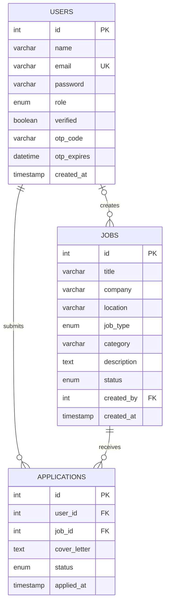

# SkillBridge ER Diagram

```mermaid
erDiagram
    USERS ||--o{ APPLICATIONS : submits
    JOBS ||--o{ APPLICATIONS : receives
    USERS o|--o{ JOBS : creates

    USERS {
        int id PK
        varchar name
        varchar email UK
        varchar password
        enum role
        boolean verified
        varchar otp_code
        datetime otp_expires
        timestamp created_at
    }
    JOBS {
        int id PK
        varchar title
        varchar company
        varchar location
        enum job_type
        varchar category
        text description
        enum status
        int created_by FK
        timestamp created_at
    }
    APPLICATIONS {
        int id PK
        int user_id FK
        int job_id FK
        text cover_letter
        enum status
        timestamp applied_at
    }
```
